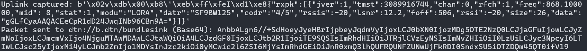
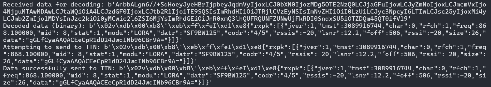
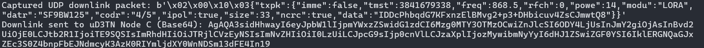
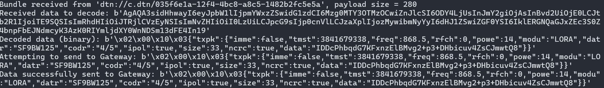

# µD3TN LoRaWAN Integration

The messages captured within this LoRaWAN flow with µD3TN as an intermediary.

## Screenshots

### Uplink

**Screenshot 1** - UDP uplink packets are captured at the gateway and forwarded to µD3TN Node A using the AAP2 protocol.

**Screenshot 2** - Uplink bundles received by µD3TN Node B are processed and sent to The Things Network (TTN) via AAP2.

### Downlink

**Screenshot 3** - UDP downlink packets received from TTN and forwarded to µD3TN Node C.

**Screenshot 4** - Downlink data from µD3TN Node C is processed and transmitted to the LoRa gateway, completing the message cycle.
